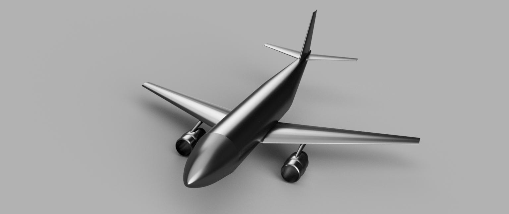
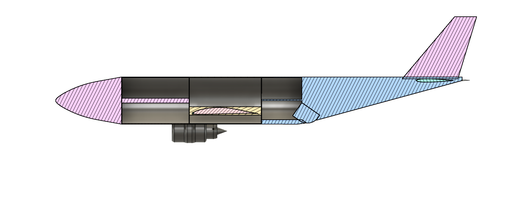

# Aircraft_Design

Code developed to calculate the design parameters of an aerial refuelling airplane. 
The plane is designed to carry 30 metric tons of fuel and refuel other smaller aircrafts in-flight.

The CAD model and the cross section view of the designed plane is shown here:

